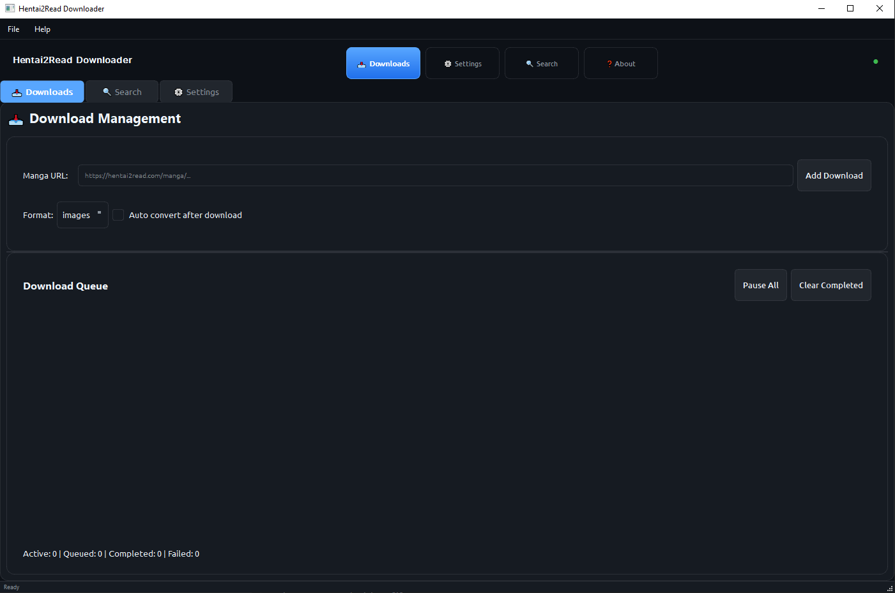

# Hentai2Read Downloader - Usage Guide

A modern, modular Python application for downloading manga from hentai2read with both CLI and GUI interfaces.

## Table of Contents
- [Installation](#installation)
- [Running the Application](#running-the-application)
  - [GUI Mode](#gui-mode)
  - [CLI Mode](#cli-mode)
- [CLI Commands](#cli-commands)
  - [Download Command](#download-command)
  - [Search Command](#search-command)
  - [Config Command](#config-command)
- [GUI Features](#gui-features)
  - [Downloads Tab](#downloads-tab)
  - [Search Tab](#search-tab)
  - [Settings Tab](#settings-tab)
- [Configuration Options](#configuration-options)
  - [General Settings](#general-settings)
  - [Performance Settings](#performance-settings)
  - [Advanced Settings](#advanced-settings)
- [Output Formats](#output-formats)
  - [Images](#images)
  - [PDF](#pdf)
  - [CBZ](#cbz)

## Installation

1.  **Clone the repository:**
    ```bash
    git clone https://github.com/Yui007/hentai2read_downloader
    cd hentai2read_downloader
    ```

2.  **Install the required dependencies:**
    ```bash
    pip install -r requirements.txt
    ```

## Running the Application

### GUI Mode

To launch the graphical user interface, which is recommended for most users:
```bash
python main.py --gui
```
or the shorthand version:
```bash
python main.py -g
```

The GUI provides a modern interface with:
- Download management
- Search functionality
- Settings configuration
- Progress visualization

### CLI Mode

For command-line enthusiasts, the application offers a powerful set of commands.
```bash
python main.py [COMMAND]
```

To see the main help message with all available commands:
```bash
python main.py --help
```

## CLI Commands

### Download Command

Start an interactive manga download process directly from a URL.
```bash
python main.py download
```
The command will prompt you to:
1.  Enter a manga URL from hentai2read.
2.  It will then fetch metadata and download all chapters.
3.  After downloading, you can optionally convert the images to PDF or CBZ format.
4.  Finally, you can choose to delete the original images to save space.

### Search Command

Search for manga on hentai2read and select one to download.
```bash
python main.py search
```
The command will guide you through:
1.  Entering a search query.
2.  Displaying the search results in a table.
3.  Entering the ID of the manga you wish to download.
4.  Confirming your selection and starting the download.

### Config Command

Manage the application's configuration interactively.
```bash
python main.py config
```
This allows you to set:
-   The default download path.
-   The maximum number of concurrent downloads.
-   You can then save these settings to a `.env` file.

## GUI Features

The GUI is organized into three main tabs for ease of use.



### Downloads Tab

This is the main screen for managing your downloads.
-   **Add Downloads**: Paste a hentai2read URL into the input field and click "Add Download".
-   **Download Queue**: View all your active, queued, and completed downloads.
-   **Progress**: Monitor the real-time progress of each download, including status, pages downloaded, and speed.
-   **Controls**: (Future enhancement) Pause, resume, or cancel downloads.

### Search Tab

Discover new manga without leaving the application.
-   **Search Bar**: Enter your query and hit "Search".
-   **Results**: View search results in a list.
-   **Download**: Select a manga from the results and click "Download" to add it to the queue in the Downloads tab.

### Settings Tab

Customize the application to fit your needs. The settings are divided into three sub-tabs:

-   **General**: Configure file and download settings.
-   **Performance**: Adjust network and performance options.
-   **Advanced**: Control logging, conversion, and experimental features.

## Configuration Options

You can configure the application via the GUI's **Settings Tab** or by editing the `.env` file directly.

### General Settings
-   **Download Directory**: The folder where your downloads will be saved.
-   **Default Format**: The default output format (Images, CBZ, PDF).
-   **Auto Convert**: Automatically convert to the selected format after downloading.
-   **Delete Images After Conversion**: Clean up the original image files after creating a PDF or CBZ.
-   **Create Subdirectories**: Organize downloads into folders named after the manga title.
-   **Organize by Date**: Create date-based subfolders for downloads.

### Performance Settings
-   **Max Concurrent Downloads**: Number of manga to download simultaneously.
-   **Workers per Download**: Number of threads to use for downloading images for a single chapter.
-   **Connection Timeout**: How long to wait for the server to respond.
-   **Retry Attempts**: Number of times to retry a failed image download.
-   **Image Cache Size**: Memory allocated for caching images.
-   **Rate Limit**: Enable or disable rate limiting for requests.
-   **Max Requests/Second**: The maximum number of requests per second when rate limiting is enabled.

### Advanced Settings
-   **Log Level**: Control the verbosity of logs (`DEBUG`, `INFO`, `WARNING`, `ERROR`, `NONE`). `NONE` disables all logging.
-   **Enable Debug Mode**: Overrides the log level to `DEBUG` for detailed troubleshooting.
-   **Save Logs to File**: Store logs in a file.
-   **PDF Quality**: Set the quality of the output PDF (`Low`, `Medium`, `High`, `Maximum`).
-   **Image Compression**: Set the compression level for images in the final output.
-   **Experimental Features**: Options like parallel conversion and smart retries.

## Output Formats

You can save your downloaded manga in several formats.

### Images
This is the default format. The application saves all images as-is in a dedicated folder for each chapter.

### PDF
The application will convert the downloaded images into a single `.pdf` file for easy reading and sharing.

### CBZ
A popular format for digital comics. The application will create a `.cbz` archive containing all the chapter images.
